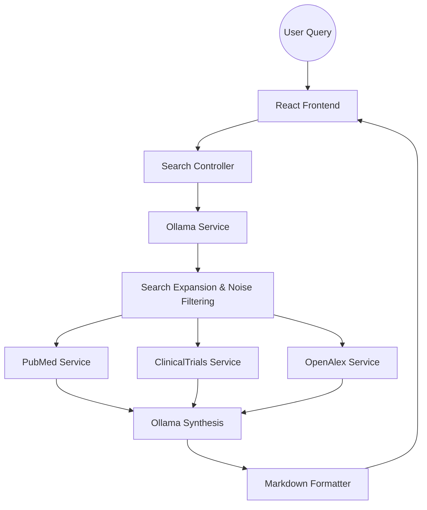

# 🩺 Curalink: Medical Research Intelligence

Curalink is a high-precision AI research assistant built for clinical investigators and medical professionals. Unlike general-purpose LLMs that often hallucinate medical data or "invent" connections, Curalink uses a **Grounding-First Architecture** to verify every claim against PubMed, ClinicalTrials.gov, and OpenAlex.

---

## 🚀 The Architecture Problem & Our Solution

### The Problem: The "Intelligence Gap"
Standard AI assistants for medical research suffer from two critical failures:
1. **Medical Hallucinations**: Connecting unrelated papers (e.g., linking a "summer cold" to "nurse perceptions of AI") because they share generic keywords.
2. **Noise Pollution**: Mixing industrial search results (e.g., "Sugarcane Milling") into clinical queries about nutrition or metabolic health.
3. **Ambiguity**: Failing to distinguish between similar medical terms like *Diabetes Mellitus* (sugar) and *Diabetes Insipidus* (water).

### Our Solution: The Grounded Pipeline
We rebuilt the research flow to ensure **Honesty and Precision**:
*   **Search Expansion Layer**: Custom logic that filters industrial noise (`NOT milling`) and disambiguates medical conditions based on symptom context.
*   **The "Honesty Clause"**: A strict inference protocol where the AI explicitly admits when a specific connection doesn't exist in the database.
*   **Dual-Stream Visualization**: A real-time research sidebar that separates technical publications from ongoing clinical trials.

---

## ✨ Key Features

- **Quick Summaries**: 1-sentence TL;DR of complex medical topics generated instantly at the top of every report.
- **Interactive Research Sidebar**: Dual-tab navigation (Papers vs. Trials) with live result counts and glassmorphism styling.
- **Markdown-Rich Reports**: Structured analysis with headers, bold text, and clickable [1], [2] citations.
- **Multi-Database Integration**:
  - **PubMed**: 30M+ citations for biomedical literature.
  - **ClinicalTrials.gov**: The official global registry of human studies.
  - **OpenAlex**: Open-source index of scholarly work.

---

## 🛠️ Architecture



---

## 💻 Installation

### Prerequisites
- Node.js (v18+)
- MongoDB
- Ollama (Running locally with `llama3` or similar)

### Setup
1. **Clone the repo**:
   ```bash
   git clone https://github.com/Humanity-founders/Curalink.git
   ```
2. **Backend Setup**:
   ```bash
   cd backend
   npm install
   npm run dev
   ```
3. **Frontend Setup**:
   ```bash
   cd frontend
   npm install
   npm run dev
   ```

---

## 🩺 Tech Stack
- **Frontend**: React, Tailwind CSS, Framer Motion, React-Markdown.
- **Backend**: Node.js, Express, Axios.
- **Database**: MongoDB (Mongoose).
- **AI/LLM**: Ollama (Self-hosted for privacy and medical data sovereignty).

---

## 📜 Acknowledgments
Developed for the Humanity Hackathon to advance physician-AI collaboration through grounded evidence.
